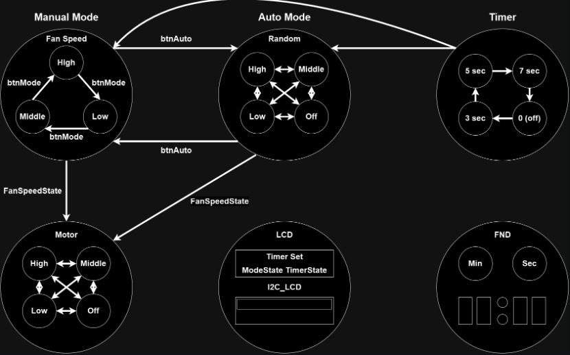
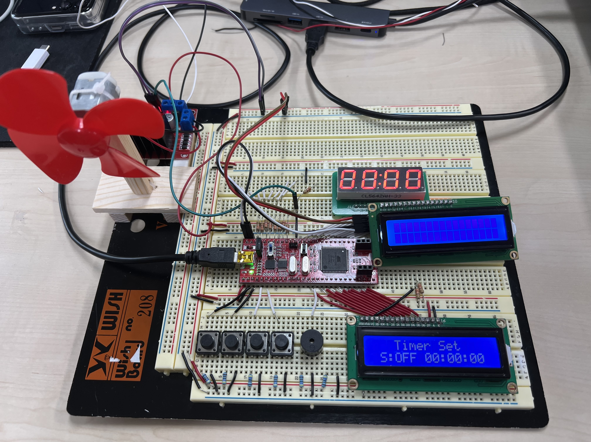
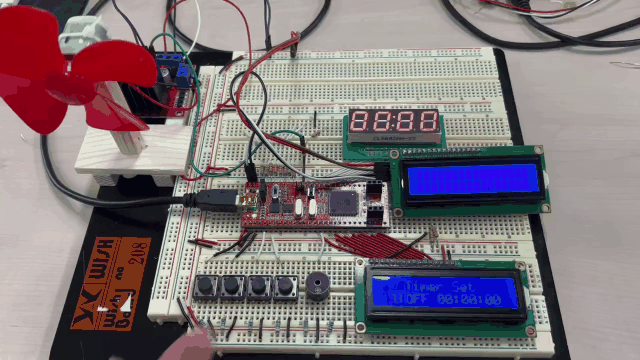
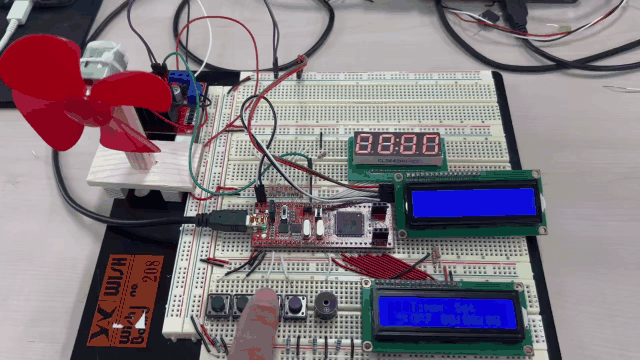

# 🌬️ **디지털 선풍기 프로젝트**  

디지털 선풍기는 **Atmega128A**를 기반으로 풍량 조절, 타이머 설정, 직관적인 LCD 상태 표시와 부저를 활용한 사용자 피드백을 제공하는 IoT 기반 프로젝트입니다. 직관적인 사용자 경험과 효율적인 설계를 목표로 구현되었습니다.


## 📌 **프로젝트 개요**
- **프로젝트 기간**: 2024.08.06 ~ 2024.08.09
- **주요 기능**:
  - **풍량 조절**: PWM을 활용해 Low, Middle, High, Auto 모드 구현.
  - **타이머 설정**: 3초, 5초, 7초 단위로 자동 종료.
  - **LCD 상태 표시**: I2C LCD로 실시간 상태 정보 제공.
  - **Serial 통신**: 원격으로 풍량 및 타이머 제어 가능.
  - **부저 알림**: 사용자 이벤트 발생 시 청각 피드백 제공.


## 🛠️ **주요 기술 스택**
| 기술                 | 설명                                             |
|----------------------|--------------------------------------------------|
| **Atmega128A**       | 하드웨어 제어 및 MCU 기반 시스템 개발             |
| **Microchip Studio** | Atmega128A 펌웨어 작성                           |
| **C언어**            | 코드 작성 및 FSM 설계                            |
| **I2C 통신**         | LCD와 FND를 연결해 실시간 상태 표시               |
| **UART 통신**        | Serial 데이터를 통해 원격 제어 구현               |

## 📂 **디렉토리 구조**

```plaintext
📁 src
├── 📂 AP
│   ├── 📂 Listener         # 이벤트 리스너 구현
│   ├── 📂 Presenter        # UI 상태 갱신 처리
│   ├── 📂 Service          # 비즈니스 로직 처리
│   ├── apMain.c            # 메인 실행 파일
│   └── apMain.h            # 메인 헤더 파일
├── 📂 Driver
│   ├── 📂 Button           # 버튼 입력 처리
│   ├── 📂 Buzzer           # 부저 제어
│   ├── 📂 Fan              # 선풍기 모터 제어
│   ├── 📂 FND              # FND 출력 관리
│   ├── 📂 I2C_LCD          # I2C LCD 상태 표시
│   └── 📂 LCD              # LCD 출력 제어
├── 📂 Model
│   ├── Model_FanState      # 팬 상태 모델
│   └── Model_TimerState    # 타이머 상태 모델
├── 📂 Periph
│   ├── GPIO                # GPIO 핀 제어
│   ├── I2C                 # I2C 통신 처리
│   ├── TIM                 # 타이머 인터럽트 처리
│   └── UART0               # UART0 통신 처리

```

## 🎯 **프로젝트 주요 기능**

### 1️⃣ **풍량 조절**
- **Low / Middle / High / Auto 모드**:
  - PWM 신호를 사용해 5V DC 모터의 속도 제어.
  - Auto 모드에서는 타이머 인터럽트를 활용해 2초마다 랜덤 풍량 전환.
- **Serial 통신 명령어**:
  - "OFF", "LOW", "MIDDLE", "HIGH" 명령어로 원격 제어 가능.


### 2️⃣ **타이머 설정**
- **타이머 간격**: 3초, 5초, 7초.
- **버튼 입력**:
  - 4번 버튼 클릭 횟수에 따라 타이머 설정.
- **타이머 종료 시 동작**:
  - 설정된 시간이 끝나면 모터가 자동으로 정지.
  - 남은 시간을 LCD와 FND에 표시.


### 3️⃣ **부저 피드백**
- **PWM 신호를 이용한 부저 동작**:
  - 버튼 클릭 또는 Serial 명령 시 이벤트를 청각적으로 알림.
- **안정적 작동 구현**:
  - 부저 출력 후 일정 딜레이를 적용해 신호 충돌 방지.


### 4️⃣ **LCD 상태 표시**
- **풍량 및 타이머 상태 표시**:
  - I2C 통신 방식으로 LCD에 실시간 정보 표시.
  - 현재 풍량 모드 (Low, Middle, High, Auto) 및 타이머 남은 시간 제공.


### 5️⃣ **Serial 통신 제어**
- **UART 기반**:
  - 원격으로 Atmega128A에 명령 전송 가능.
- **명령어**:
  - `LOW`, `MIDDLE`, `HIGH`, `OFF`와 같은 텍스트 명령어로 모터 및 타이머 제어.


## 🖼️ **구현 상세**

### 🌟 **FSM 설계**
- FSM(Finite State Machine)을 기반으로 선풍기의 각 동작 상태를 설계.
  - **초기 상태**: OFF.
  - **풍량 상태**: LOW → MIDDLE → HIGH → AUTO 순환.
  - **타이머 상태**: 타이머 설정 및 종료 이벤트 처리.



### 📊 **S/W 스택**
1. **타이머 인터럽트**:
   - 타이머 인터럽트를 통해 모터 제어 및 이벤트 실시간 처리.
2. **UART 통신 처리**:
   - 수신된 명령어를 내부 버퍼에 저장 후 FSM에서 처리.
3. **LCD 업데이트**:
   - I2C 통신으로 풍량 상태와 타이머 정보를 표시.


## 📊 **SW 스택 구조**

디지털 선풍기 프로젝트는 효율적인 계층적 소프트웨어 구조를 기반으로 설계되었습니다. SW 스택은 다음과 같은 4개의 주요 계층으로 나뉘며, 각 계층은 독립적이고 역할에 맞게 설계되어 유지보수와 확장성을 높였습니다.

- **AP Layer**: 비즈니스 로직과 사용자 인터페이스 처리
- **Driver Layer**: 하드웨어 기능을 상위 계층에서 사용할 수 있도록 추상화
- **Periph Layer**: MCU의 주변 장치와 직접 상호작용
- **HW Layer**: 물리적 하드웨어 제어


## 📸 **시스템 구성도**



## 📽 **시연 영상**

### [수동 제어 모드](https://drive.google.com/file/d/149j8o64nI5u5eW9uBqYclimtLQP_zgrO/view?usp=sharing)


### [팬 속도 제어](https://drive.google.com/file/d/1Gy9ZgQZpViIaTx7sKxo-1d-yjzWNMSqR/view?usp=sharing)


### [자동 모드](https://drive.google.com/file/d/1NTWOVqNGYCgdfyRx5it9c1xxGzLwExng/view?usp=sharing)


### [타이머 설정](https://drive.google.com/file/d/1ClRsJgMMWoc26R4oO2JI8ulwaUx-Vle-/view?usp=sharing)


### [시리얼통신제어](https://drive.google.com/file/d/18L2TxKMN-7aSuCmTJh-_GzmyUUEg6Hyt/view?usp=sharing)


### [시리얼통신제어2](https://drive.google.com/file/d/1nx_zPNHD6oGMiegrY0XCvMZDa9lffJlk/view?usp=sharing)
